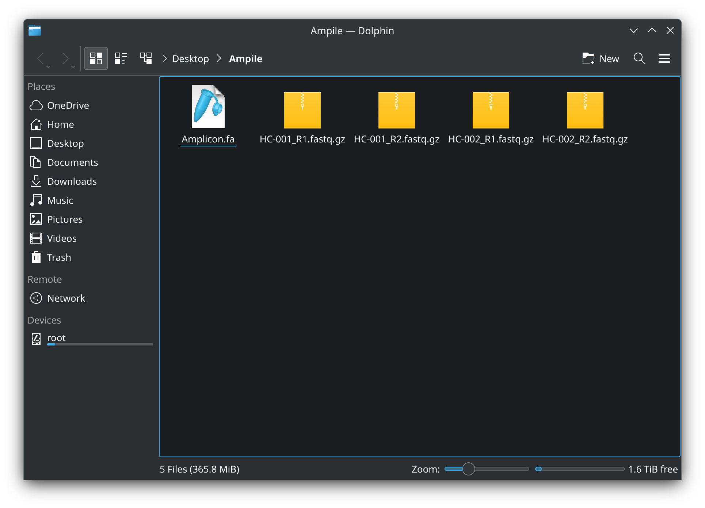
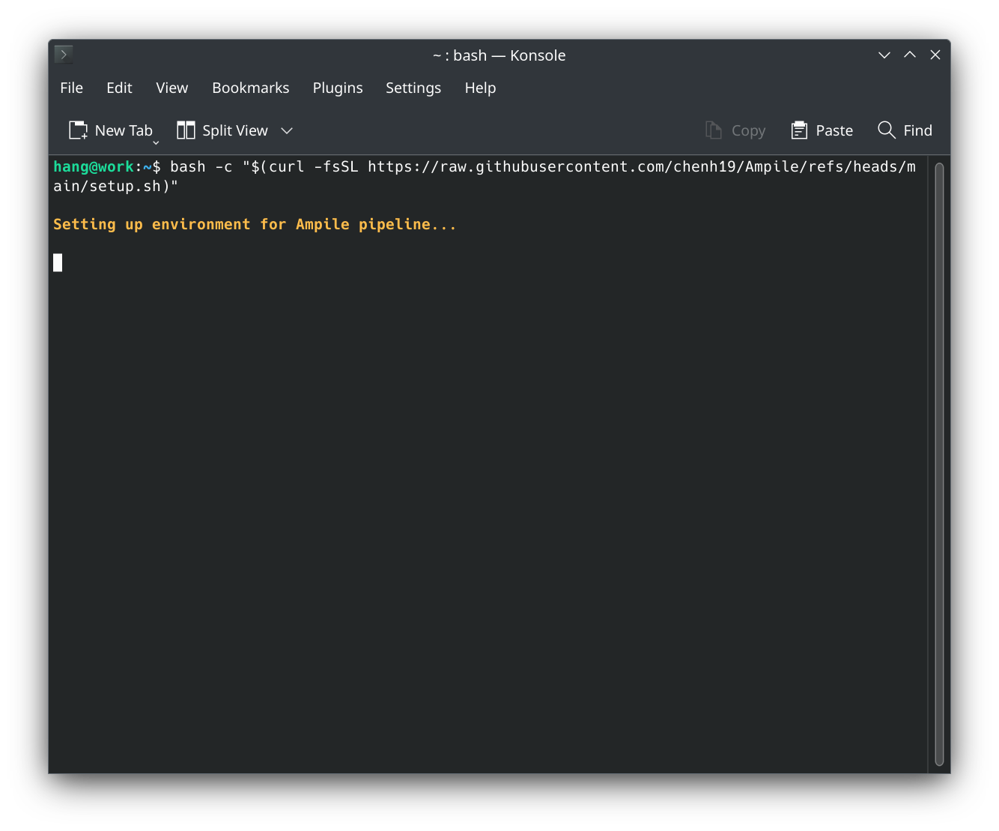
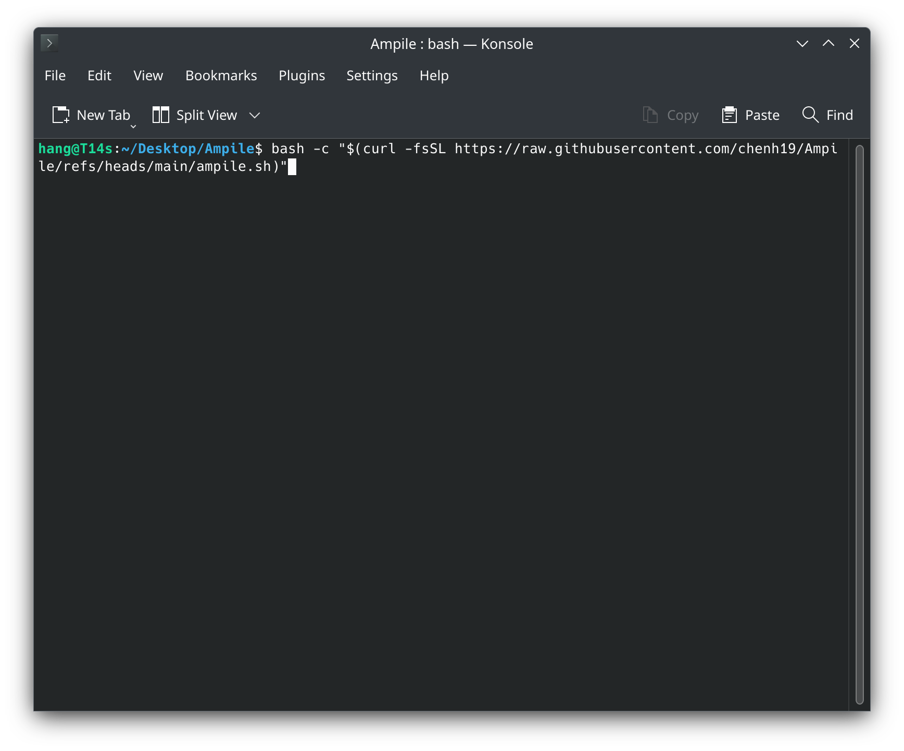
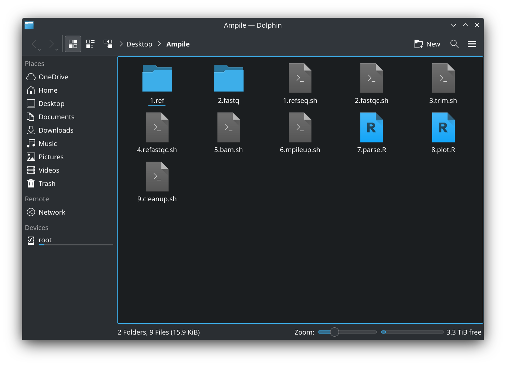
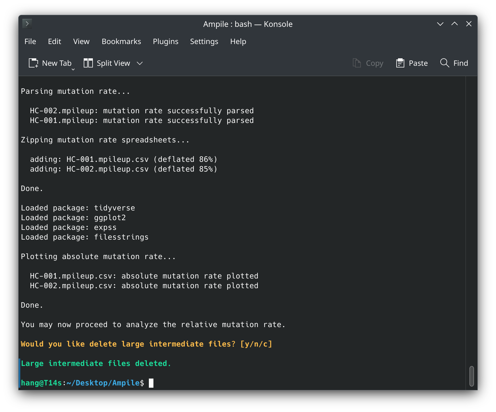
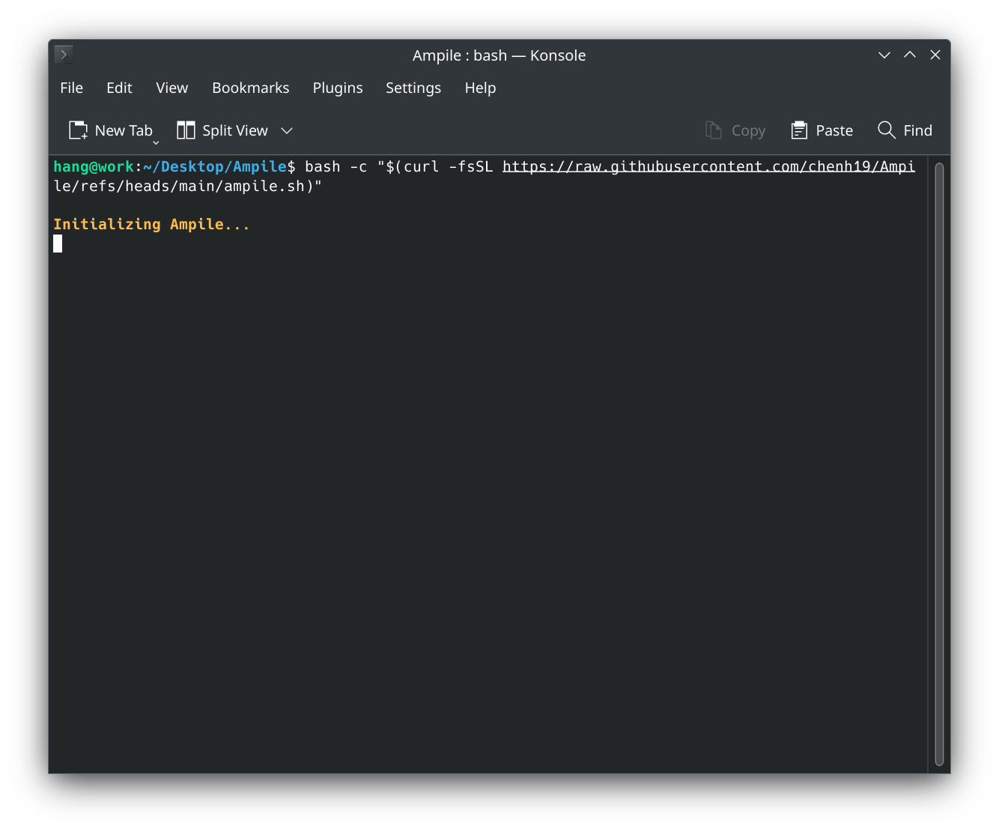

### [1/4] Setup environment

Pipeline failures are often due to an improperly configured environment. To ensure a robust and consistent setup for Ampile, I've created a dedicated configuration script. To execute the setup:

- Connect to internet
- Open Terminal
- Paste in the below command and press ```Enter``` to run:

<pre> bash -c "$(curl -fsSL https://raw.githubusercontent.com/chenh19/Ampile/refs/heads/main/setup.sh)" </pre>

<details>
<summary>**Note:**</summary>

<div style="font-size: 0.9em">

- This pipeline is dependent on: ```R```, ```bwa```, ```fastqc```, ```fastp```,  ```samtools```, ```bamtools```, ```parallel```, ```r-tidyverse```, ```r-expss```, ```r-filesstrings```, ```r-foreach```, ```r-doParallel```. It can be run in Linux, FreeBSD, and MacOS environments.
- Running the setup script does not require directory changes or administrative privileges.
- [ampile.sh](https://github.com/chenh19/Ampile/blob/main/ampile.sh) will verify that all required packages are installed before proceeding with the analysis.
- If you're using an unsupported OS or prefer an alternative setup method, please ensure that all required dependencies are installed.

</div>

</details>


### [2/4] Prepare input files

- Prepare reference sequences (```.fa``` files) and sequencing reads (```.fastq``` or ```.fastq.gz``` files) in a master folder (you may name the folder as desired):

<div style="text-align: center;">
  
</div>

- You may also organize the files into the two designated subfolders, ```./1.ref/``` and ```./2.fastq/```:

<div style="text-align: center;">
  
</div>

<details>
<summary>**Note:**</summary>

<div style="font-size: 0.9em">

- The pipeline will automatically organize input files if they are not already in the two designated subfolders.
- The pipeline will also automatically compress sequencing reads to ```.fastq.gz``` if they are provided in ```.fastq``` format.

</div>

</details>


### [3/4] Running the pipeline

- Connect to internet
- Open Terminal
- Change current directory to the folder containing the input files. For example: ```cd ~/Desktop/Ampile/```
- Paste in the below command and press ```Enter``` to run:

<pre> bash -c "$(curl -fsSL https://raw.githubusercontent.com/chenh19/Ampile/refs/heads/main/ampile.sh)" </pre>

<div style="text-align: center;">
  
</div>

- Or, you may [download the GitHub repo](https://github.com/chenh19/Ampile/archive/refs/heads/main.zip) and placed [all the scripts in /src/ folder](https://github.com/chenh19/Ampile/tree/main/src) with the input files to run manually:

<div style="text-align: center;">
  
</div>

<details>
<summary>**Note:**</summary>

<div style="font-size: 0.9em">

- All scripts assume the master folder as the working directory.

</div>

</details>


### [4/4] Done

<div style="text-align: center;">
  
</div>

<div style="text-align: center;">
  
</div>

- You may further analyze the parsed mutation rates and perform comparative analyses between groups. The corresponding spreadsheets are located at ```./3.analysis/8.spreadsheets/3.mpileup_parse/```.

<details>
<summary>**Note:**</summary>

<div style="font-size: 0.9em">

- The directories ```./3.analysis/1.refseq/```, ```./3.analysis/2.trim/```, ```./3.analysis/3.bam/```, and ```./3.analysis/4.mpileup/``` contain large intermediate files. You may choose to delete them unless you need them for troubleshooting.

</div>

</details>
