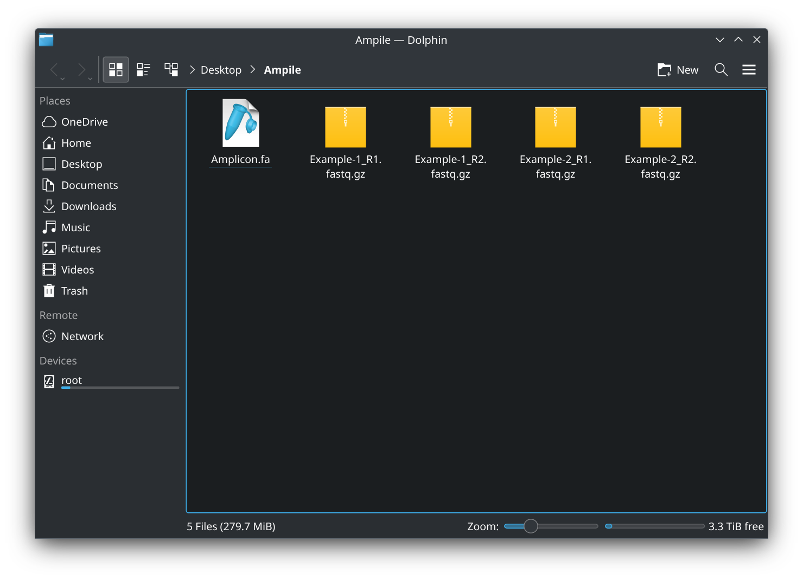

## Ampile: Amplicon pileup analysis

### [1/3] Prepare input files

- Prepare reference sequences and sequencing reads:


### [2/3] Running the pipeline
- Connect to internet
- Copy the below command, paste in terminal and press ```Enter``` to run:
```
bash -c "$(curl -fsSL https://raw.githubusercontent.com/chenh19/Ampile/refs/heads/main/ampile.sh)"
```


- Or, you may [download the GitHub repo](https://github.com/chenh19/Ampile/archive/refs/heads/main.zip) and placed [all the scripts in /src/ folder](https://github.com/chenh19/Ampile/tree/main/src) with the input files:



### [3/3] Done

- Done:


- You may further analyze the parsed mutation rates and perform comparative analyses between groups.
